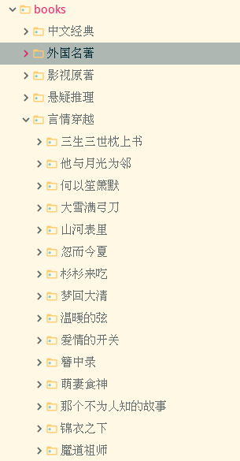
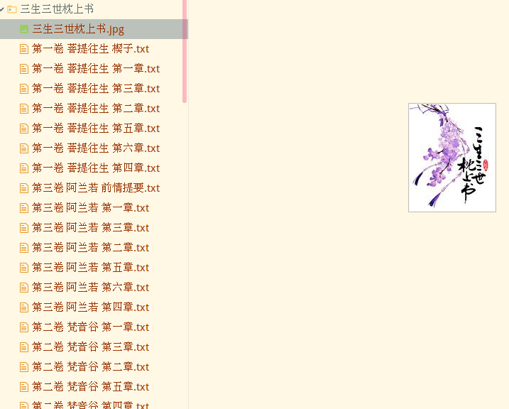
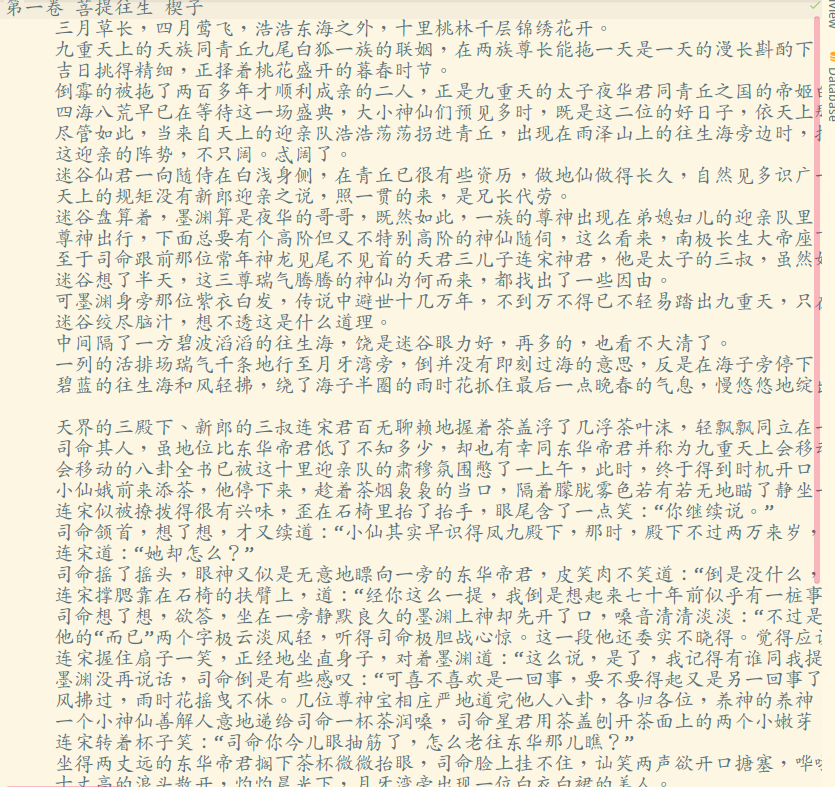

# 落霞小说网

如果对您有帮助，希望给个 Star ⭐，谢谢！😁😘🎁🎉

Github 项目地址 [pighui](https://github.com/pighui)/[luoxia](https://github.com/pighui/luoxia)

# 简介

基于Scrapy框架的落霞小说网小说爬取

爬虫入口地址：<http://www.luoxia.com/>

# 技术点

自定义数据管道、图片管道、中间件

文本数据的清理、拼接

# 克隆项目

```bash
git clone git@github.com:pighui/luoxia.git
```

# 项目启动

## 1.安装环境包

开发环境：python3.7

```bash
cd luoxia
pip install -r requirements.txt
```

## 2.运行爬虫

```bash
scrapy crawl book
```

# 数据概览

## 1.文件目录



## 2.书籍目录+封面图片



## 3.文本内容

