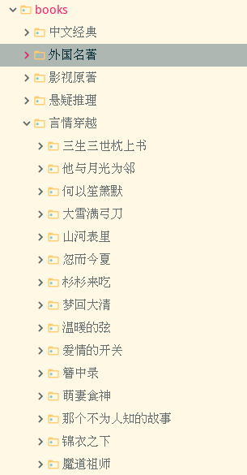
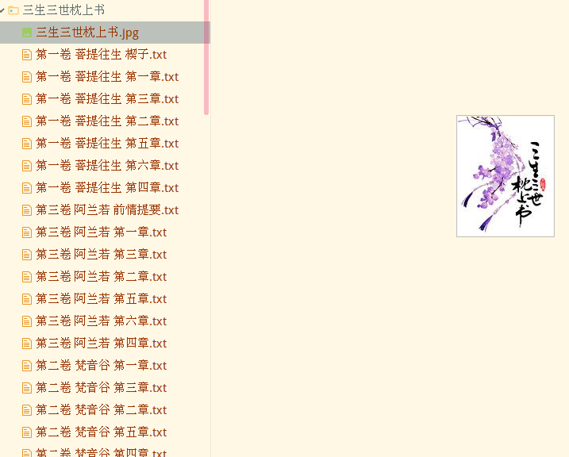
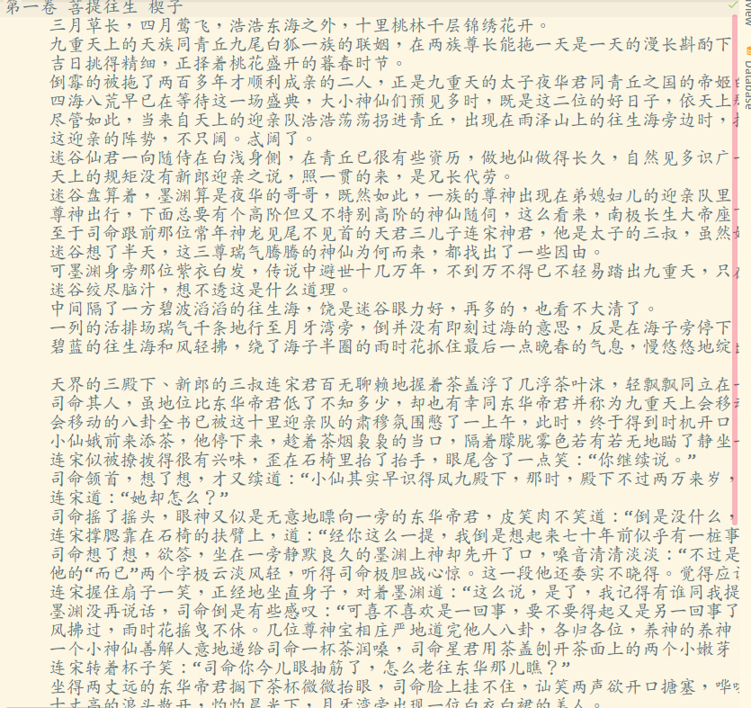

# 落霞小说网

如果对您有帮助，希望给个 Star ⭐，谢谢！😁😘🎁🎉

Github 项目地址 [pighui](https://github.com/pighui)/[luoxia](https://github.com/pighui/luoxia)

# 简介

基于Scrapy框架的读书网信息爬取

爬虫入口地址：<http://www.luoxia.com/>

实现了以下部分：

- 分类地址提取

提取主页所有图书的分类地址

- 书籍地址提取

提取每个分类下的所有图书地址

- 章节地址提取

提取每本书籍的所有章节地址

- 文本数据的清洗

保留章节名，保留段落格式，剔除了微信公众号等广告信息。

- 章节文本内容下载

按  books/分类/书名/章节名.txt目录保存每个章节的文本信息

- 书籍封面图片下载

自定义图片下载管道，保存目录同上。文件名：书名.png

**为什么按章节保存，而不是生成整本的txt文件？**

​	在爬取的过程中，因为此网站的服务器问题，有的章节请求不到，造成数据缺失。按章节保存可以为以后的数据整理提供便利。

​	scrapy的调度器使用的是LIFO（后进先出）算法，如果生成整本的txt文件，会造成章节倒序写入的结果。

**为什么要自定义下载管道？自定义文件名？而不用sha1加密生成文件名？**

​	scrapy自带的图片下载管道默认会把所有图片保存在一个目录，并且文件名是sha1加密生成的，目的是为了保证文件名唯一，防止数据丢失。

​	使用自定义的图片下载管道，可以实现自定义文件保存目录，自定义文件名，使数据看起来更加直观、简洁。

# 克隆项目

```bash
git clone git@github.com:pighui/luoxia.git
```

# 项目启动

## 1.安装环境包

测试环境：python3.7

```bash
cd luoxia
pip install -r requirements.txt
```

**或者**

```python
pip install scrapy
```

## 2.运行爬虫

```bash
scrapy crawl book
```

# 数据概览

## 1.文件目录



## 2.书籍封面图片



## 3.文本内容

